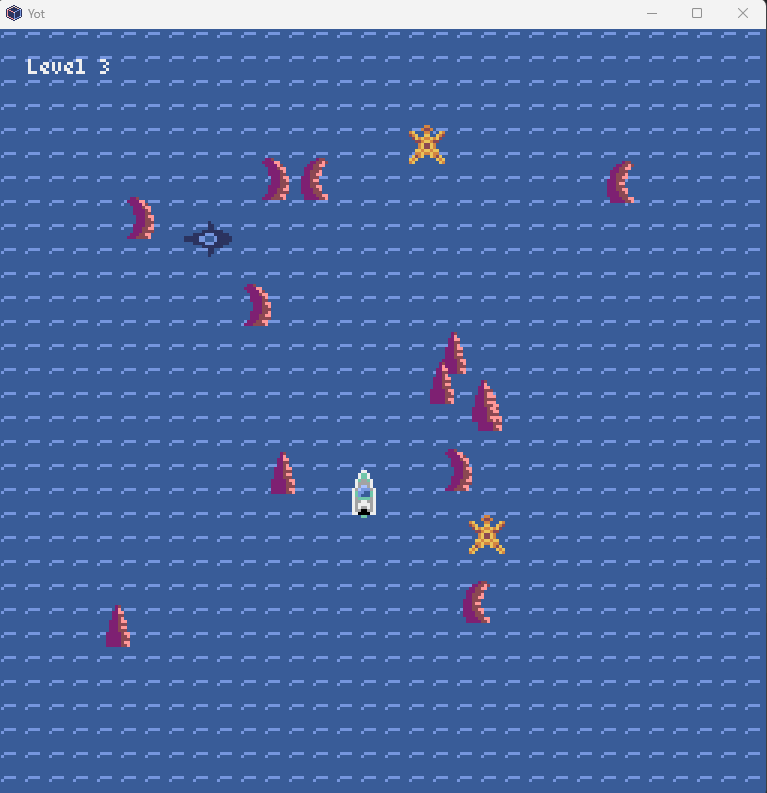

# YOT 🦈 — Nuit du Code 2025

> *Pronounced like “yacht” — a tribute to its creators: **Y**ouness, **O**céane, and **T**itouan.*

A fast-paced **chasing game** made during the **Nuit du Code 2025** with **Pyxel**.  
You play as a swimmer trying to survive while a hungry shark relentlessly chases you through obstacle-filled waters!

---

## 🎮 How to Play
- Move with **ZQSD** (AZERTY layout):
  - **Z** → Up  
  - **Q** → Left  
  - **S** → Down  
  - **D** → Right  
- Hold **Shift** to **sprint** and escape faster!
- Avoid obstacles 
- Survive as long as possible — the shark *always* gets faster!

---

## 🛠️ Built With
- [Pyxel](https://github.com/kitao/pyxel) — Retro game engine for Python
- Simple collision & path prediction logic for the shark AI
- Dynamic difficulty: shark speeds up over time!

---

## 📦 How to Run
1. Install Pyxel:
   ```bash
   pip install pyxel

